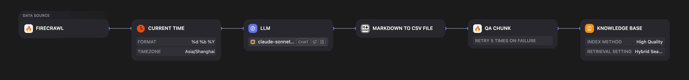
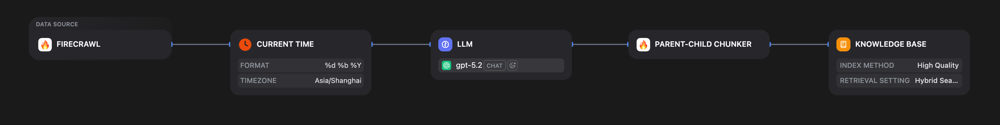
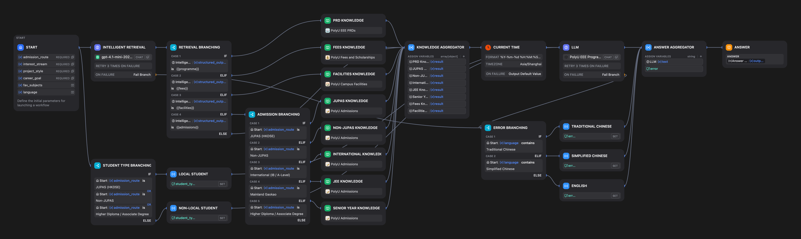

# Dify Configuration

This folder stores exported Dify artifacts that define ingestion pipelines and the runtime chat workflow. Without these, the web frontend alone cannot reproduce the retrieval and orchestration behavior.

## Files

| File | Type | Purpose |
|---|---|---|
| `Intelligent Programme Advisor Chatbot.yml` | Chatflow | Runtime conversation orchestration |
| `PolyU EEE PRDs.pipeline` | Knowledge Pipeline | Ingestion config for programme regulation docs |
| `PolyU Admissions.pipeline` | Knowledge Pipeline | Ingestion config for admissions documents |
| `PolyU Fees and Scholarships.pipeline` | Knowledge Pipeline | Ingestion config for fees/scholarship docs |
| `PolyU Campus Facilities.pipeline` | Knowledge Pipeline | Ingestion config for campus facility docs (QA chunking) |
| `chatflow_flowchart.png` | Diagram | Visual map of the Chatflow orchestration |
| `admission_kb_flowchart.png` | Diagram | Visual map of the Admissions & Fees/Scholarships KB pipeline |
| `facilities_kb_flowchart.png` | Diagram | Visual map of the Campus & Hall Facilities KB pipeline |

## Knowledge Ingestion Pipelines (`*.pipeline`)

Three pipelines (PRDs, Admissions, Fees/Scholarships) share the same foundational retrieval architecture, with per-pipeline weight tuning:

- **Embedding model:** `text-embedding-3-large`
- **Retrieval mode:** Hybrid (vector + keyword), combining semantic and lexical matching
- **Keyword weight:** `0.3` / **Vector weight:** `0.7`
- **Reranking:** All four pipelines use `jina-reranker-m0`
- **Chunking strategy (PRDs, Admissions, Fees):** Parent-child segmentation — this maps directly to the `Parent > Child` heading format produced by `data-pipeline/dataset_cleansing.py`. The parent chunk provides topic context; the child chunk holds the specific content retrieved.
- **Chunking strategy (Campus Facilities):** QA chunking — see [Campus Facilities QA Pipeline](#campus-facilities-qa-pipeline) below.

Separating the three domains into distinct pipelines allows retrieval weight tuning and reranker selection per document type without cross-contaminating results between programme policy, admissions, and financial content.

## Campus Facilities QA Pipeline

The Campus Facilities knowledge base required a fundamentally different ingestion strategy. Unlike the Admissions and Fees pages, campus facility webpages contain sparse, scattered content distributed across many short pages. Preliminary testing showed that parent-child chunking produced thin, context-poor chunks that performed poorly in retrieval. A QA-based pipeline was adopted instead.

The pipeline executes the following node sequence:

1. **Firecrawl Node (Start Node):** Crawls the designated PolyU campus facility pages, extracting raw web text and the source URL for each page.
2. **Current Time Node:** Generates the current date in parallel, which is embedded into the Q&A data for temporal awareness.
3. **LLM Node (`claude-sonnet-4-20250514`):** Receives the scraped content and generates discrete Q&A pairs from a prospective student's perspective as a Markdown table. Claude Sonnet 4 was selected over GPT-5.2 for its stronger performance on constrained instruction-following and structured Markdown output compliance. The model is instructed to:
   - Record the Source URL and As-of Date in the first two rows.
   - Extract meaningful questions and accurate, self-contained answers.
   - Preserve any image URLs from the source page.
   - Strictly avoid inferring or inventing values not present in the source (e.g., exact fees, room numbers, opening hours).
4. **Markdown to CSV Node:** Converts the LLM's Markdown table output into a structured CSV file.
5. **QA Chunk Node:** Parses the CSV, reading column 0 as the question and column 1 as the answer, and indexes each pair as a discrete retrieval unit into the Dify vector database.

This approach converts fragmented facility information into dense, self-contained question-answer anchors, substantially improving retrieval precision for specific facility-related queries.

## Web Crawling & Auto-Structuring Workflow (Admissions & Fees/Scholarships)

Unlike the Programme Requirement Documents (which were processed offline via MinerU and the custom scripts in `/data-pipeline`), the Admissions and Fees/Scholarships knowledge bases were ingested and structured automatically via a native Dify workflow.

The underlying data sources targeted by the workflow are:
- `https://www.polyu.edu.hk/study/ug/admissions/*`
- `https://www.polyu.edu.hk/study/ug/fees-and-scholarships/*`
*(Note: Irrelevant navigation URLs were manually pruned from the crawl list before execution).*

The dedicated Dify pipeline executes the following conceptual node sequence to build the knowledge bases:

1. **Firecrawl Node (Start Node):** Initializes the workflow by extracting the raw HTML/text payload and the targeted Source URL.
2. **Current Time Node:** Concurrently generates an accurate timestamp to guarantee temporal awareness.
3. **GPT-5.2 Conclusion Node:** An LLM transformation step explicitly prompted to restructure the noisy web data. It receives the raw web text, the source URL, and the current time stamp as three distinct, parallel payload parameters. The model then synthesizes these inputs into a strict hierarchical Markdown format that precisely mirrors Dify's parent-child ingestion constraints. 
4. **Parent-Child Chunker:** The terminal node that splices the LLM-normalized Markdown into discrete vectors and indexes them into the vector database.

### GPT-5.2 Transformation Logic

Instead of a simple narrative prompt, the `gpt-5.2` node employs a highly constrained set of formatting rules to prevent hallucination and enforce architectural compliance. The system prompt instructs the model to:
- **Enforce Chunk Boundaries:** Actively insert the required Parent and Child Markdown delimiters, slicing long paragraphs or sections systematically if they exceed the strict system-defined character bounds.
- **Maintain Grounding:** Prepend every output section with the exact Source URL and the scraped As-of Date.
- **Prevent LLM Hallucination:** Rely *exclusively* on the provided Firecrawl text. The model must preserve exact dates, specific tuition amounts, and precise hyperlinks without inferring or inventing missing details.
- **Prune Noise:** Automatically omit generic programme menus, faculty directory lists, and irrelevant alternative admission routes to keep the vector focus absolute.

## Chatbot App Workflow (`Intelligent Programme Advisor Chatbot.yml`)

This is a **Chatflow** workflow that goes beyond a simple Q&A loop:

- **Multi-branch intent routing, Metadata Filtering, and Programme Isolation:** Incoming queries are processed by the `INTELLIGENT RETRIEVAL` node, which produces three structured outputs: `class_name` (intent category), `retrieval_query` (rewritten for retrieval), and `programme_code` (PolyU programme identifier: 46408 for EE, 46409 for AIIE, 05409 for Common Year 1, or empty if the user is comparing or undecided). The `programme_code` is used as a hard metadata filter on the PRD knowledge base, ensuring each user retrieves only the programme document relevant to their declared interest stream. For admissions queries, documents are additionally filtered by a custom `route` metadata tag (`jupas`, `non-jupas`, `international`, `jee`, `senior`), ensuring applicants retrieve only criteria relevant to their specific admission pathway.
- **Conversation variable handling:** Variables from the user onboarding form (programme interest, academic background, project style, language preference) are carried as conversation-level state. These variables directly drive the aforementioned multi-branch filtering logic and actively shape the retrieval context across conversation turns.
- **Conditional LLM path selection:** The workflow applies conditional logic to select which retrieval pipeline(s) to invoke, which prevents unnecessary over-retrieval on single-domain queries.
- **Speech features:** STT and TTS are enabled, proxied through the web app's `/api/audio-to-text` and `/api/text-to-audio` routes.

## Reproducibility Workflow

1. Import all `*.pipeline` files into Dify and create the corresponding knowledge bases.
2. Index the processed markdown files from `../knowledge-base/processed/` into each knowledge base.
3. Import `Intelligent Programme Advisor Chatbot.yml` as a Chatflow app.
4. Wire the model providers and knowledge bases to the app nodes.
5. Copy the app's credentials (`APP_ID`, `APP_KEY`, `API_URL`) into `web/.env.local`.

## Versioning Note

These exports are versioned infrastructure. Frontend UX can change freely, but retrieval quality, routing logic, and chunking strategies are defined here. Any changes to pipeline parameters or workflow routing should be re-exported and committed alongside corresponding changes to `data-pipeline/` output formats.