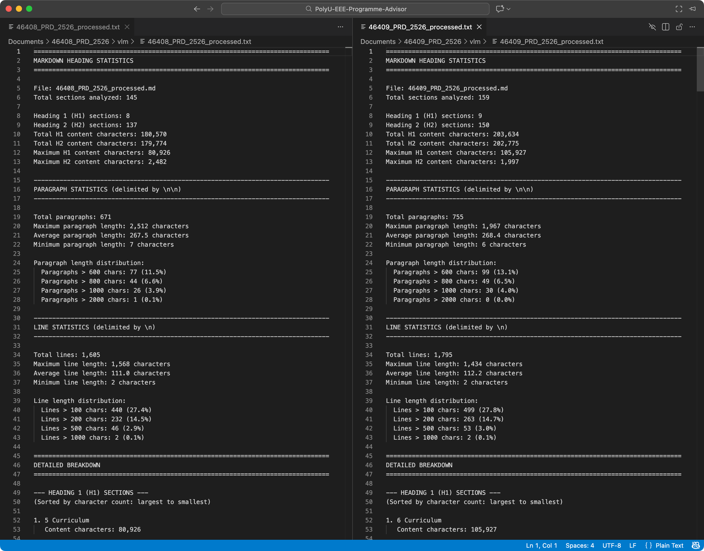
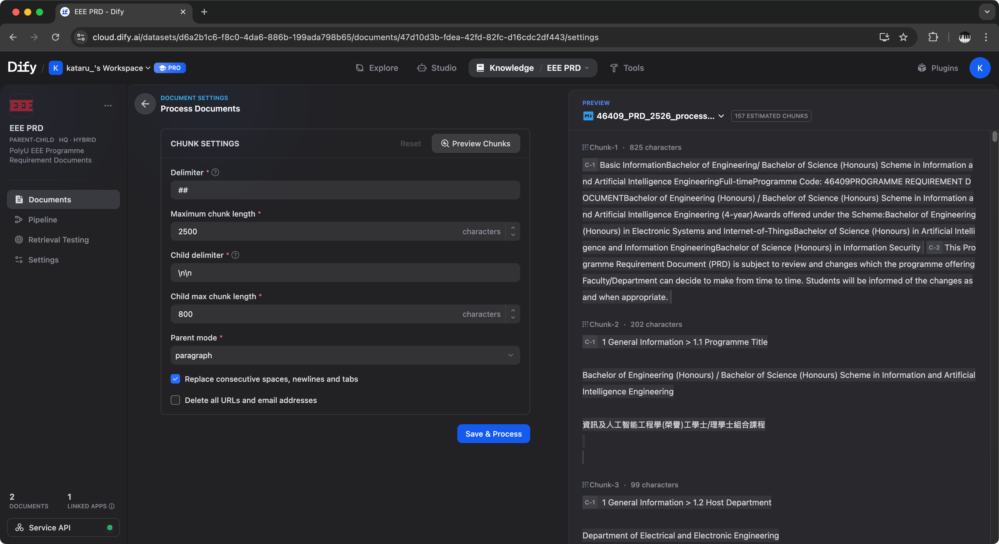

# Knowledge Base

This folder is the **factual backbone** of the advisor system. It stores source PDFs, MinerU parse intermediates, and the final retrieval-ready markdown outputs that are indexed into Dify.

## Directory Layout

```
knowledge-base/
├── raw/                   # Input PDFs (never modified by the pipeline)
├── intermediate/          # MinerU parse outputs, grouped by document
│   ├── 05409_PRD_2526/
│   ├── 46408_PRD_2526/
│   └── 46409_PRD_2526/
└── processed/             # Ready-to-index markdown + diagnostics
    ├── 05409_PRD_2526_processed.md
    ├── 05409_PRD_2526_processed_stats.txt
    ├── 46408_PRD_2526_processed.md
    ├── 46408_PRD_2526_processed_stats.txt
    ├── 46409_PRD_2526_processed.md
    └── 46409_PRD_2526_processed_stats.txt
```

## Current Inventory

- **Raw PDFs:** 3 (`05409_PRD_2526.pdf`, `46408_PRD_2526.pdf`, `46409_PRD_2526.pdf`)
- **Intermediate directories:** 3 (one per document, containing MinerU's `hybrid_auto/` parse results)
- **Processed files:** 6 (one `_processed.md` + one `_processed_stats.txt` per PDF)

The processed files range significantly in size:
- `05409_PRD_2526_processed.md` — ~81 KB
- `46408_PRD_2526_processed.md` — ~185 KB
- `46409_PRD_2526_processed.md` — ~208 KB

## Artifact Semantics

### `_processed.md`
- Cleaned, structured markdown ready for Dify indexing.
- Headings follow `## Parent > Child` format, aligned with Dify's parent-child chunk segmentation.
- Tables are converted from HTML to Markdown (rowspan/colspan propagated and deduplicated).
- A `## Basic Information` anchor section is inserted at the document start.
- Oversized H2 sections are split into `(Part N)` continuations.

### `_processed_stats.txt`
- Diagnostic file produced alongside each processed markdown.
- Reports H1/H2 section counts and character totals, max/average/min paragraph lengths, line length distributions (at 100/200/500/1000 char thresholds), and **maximum H2 section length after splitting** — the key metric proving the pipeline respected Dify's chunk size constraints.



*Sample output: `max_h2_after_processing` confirms every final chunk stays within the 2,500-character parent chunk limit configured in Dify.*



*Dify parent-child ingestion settings calibrated against the observed max H2 section length.*

## Update Lifecycle

1. Add or replace PDFs in `raw/`.
2. **Delete the corresponding processed outputs** (`_processed.md` + `_processed_stats.txt`) to allow the pipeline to reprocess. The pipeline explicitly skips any document where both files already exist — replacing the source PDF is not sufficient alone.
3. Optionally delete `intermediate/<doc>/` if a fresh MinerU extraction is also needed (e.g., if the PDF structure changed significantly).
4. Run `../data-pipeline/dataset_cleansing.py`.
5. Validate the new stats file and review the processed markdown for heading and table correctness.
6. Re-index into Dify using pipeline definitions in `../dify-config/`.

## System Role

This directory is the policy correctness layer. Fine-tuning improves assistant style, but factual accuracy and programme policy truth depend entirely on the quality and freshness of the processed markdown files here.